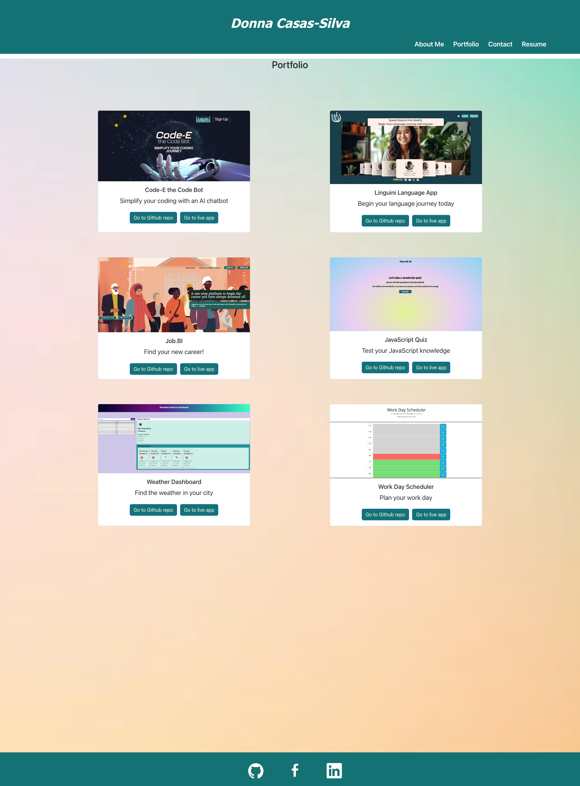

# Donna Casas-Silva Portfolio

### Table of Contents
1. [Description](#description)
2. [Installation](#installation)
3. [Technologies](#technologies) 
4. [Usage](#usage)
5. [Images](#images)
6. [Contributing](#contributing)
7. [Collaborators](#collaborators)
8. [Questions](#questions)
9. [License](#license)
10. [Project URL](#project-url)

### Description
This project is a portfolio website that showcases my skills and projects as a recent UC Berkeley Extension Coding Boot Camp graduate. This site is built using React and links the viewer to various project I built that display my range of front-end and back-end development skills, such as HTML, CSS, JavaScript, jQuery, responsive design, React, APIs, Node, Express, MySQL, Sequelize, MongoDB, Mongoose, REST, and GraphQL. The site includes a Portfolio section that contains a range of projects completed by or contributed to by me, as well as an About section that provides more information about my background and skills. Additionally there is a Contact and Resume section for more information about how to contact me and to view my resume. The site is fully responsive and can be viewed on a variety of devices, including desktop, tablet, and mobile. 

### Technologies
This project utilizes the following technologies:
- React
- JavaScript
- CSS

### Installation
To install this project, follow these steps:
1. Clone the repository to your local machine.
2. Navigate to the project directory in your terminal.
3. Run `npm install` to install the necessary dependencies.
4. Run `npm start` to start the development server.

### Usage
To use this project, follow these steps:
1. Open your web browser.
2. Navigate to the URL where the project is hosted.
3. Explore the portfolio section to view the developer's projects.
4. Explore the about section to learn more about the developer's background and skills.

### Images

### Contributing
Contributions to this project are currently not being accepted. If you would like to contribute, please contact the developer at the email listed below.

### Collaborators
This project was completed with guidance and assistance from EdX tutor, Robby Kurle.

### Questions
If you have any questions, please contact me:
- GitHub: [Augustus1110](https://github.com/Augustus1110)
- Email: donahi22@gmail.com

### License
This project is licensed under the [MIT License](https://opensource.org/licenses/MIT).

### GitHub Repository
(https://github.com/Augustus1110/Donna-Casas-Silva-Portfolio)

### Project URL
The project is currently not hosted online.